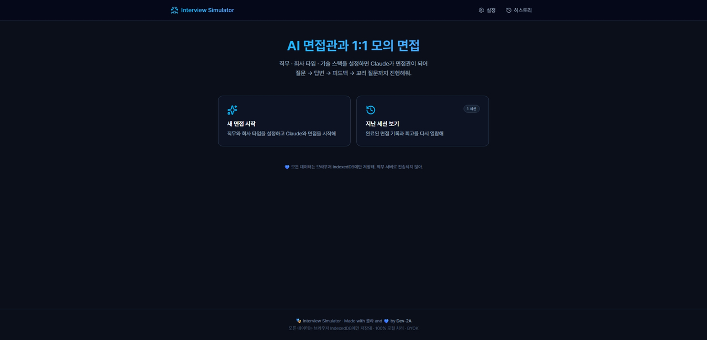
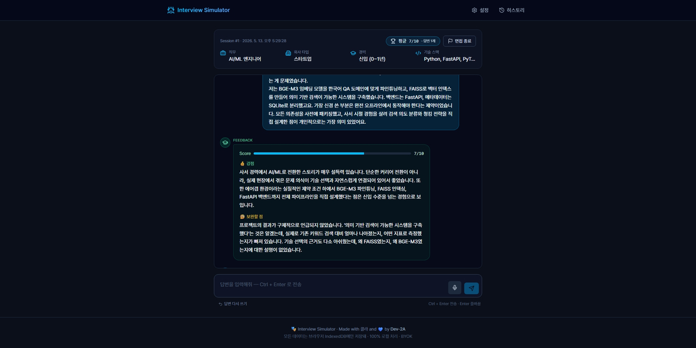
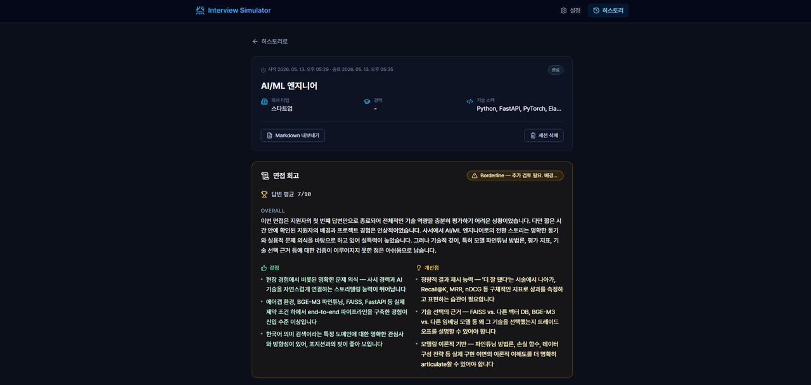

# 🎭 Interview Simulator

> Claude를 면접관으로 두는 AI 면접 연습 도구

[](https://dev-2a.github.io/interview-simulator/)
[](https://react.dev/)
[](https://vite.dev/)
[](https://tailwindcss.com/)
[](https://www.anthropic.com/)

🌐 **Live Demo**: <https://dev-2a.github.io/interview-simulator/>

---

직무 · 회사 타입 · 기술 스택을 설정하면 Claude가 그에 맞는 페르소나의 면접관이 되어
**질문 → 답변 → 피드백 → 꼬리 질문 → 전체 회고**까지 진행해주는 도구.

100% 브라우저에서 동작하며, 모든 데이터는 IndexedDB에만 저장됩니다.
API 키는 사용자 본인의 키를 직접 등록(BYOK)해 사용합니다.

---

## ✨ 주요 기능

### 🎯 맞춤형 면접관 페르소나

- **회사 타입 6종** × **경력 수준 4단계** 매트릭스
  - 스타트업, 중소·중견기업, 대기업, 빅테크/외국계, 공공·금융, SI/에이전시
  - 신입 / 주니어 / 미드 / 시니어
- 회사 타입별로 면접관 톤·관점이 달라짐 (스타트업은 0→1 구축 경험, 빅테크는 시스템 디자인 등)
- 경력 수준에 따라 질문 난이도·깊이 자동 조정

### 💬 대화형 면접 진행

- 답변 제출 → **피드백(강점·약점·점수)** + **꼬리 질문** 자동 생성
- 같은 질문 반복 방지 가드 (이번 세션 + 최근 5개 세션 통합 컨텍스트 + 유사도 자동 재요청)
- **음성 입력 지원** (Web Speech API, 한국어) — 마이크 버튼 한 번에 받아쓰기
- 답변 다시 쓰기(롤백) · 응답 대기 중 페이지 이탈 안전 처리(AbortController)
- 자동 재시도(JSON 파싱 실패·5xx 대응)

### 🏁 면접 종료 → 전체 회고

- 종료 시 Claude가 전체 대화를 보고 회고 생성
  - 전체 평가 / 강점 3개 / 개선점 3개 / Verdict / 평균 점수
- Verdict에 따라 회고 카드 색상 자동 매핑 (Pass / Borderline / Not yet)

### 📜 세션 히스토리

- 모든 세션을 카드 그리드로 한눈에
- 상태별 필터 (전체 / 진행 중 / 완료 / 중단)
- 진행 중 세션은 **"이어서 진행하기"** 로 언제든 복귀

### 📤 Markdown 내보내기

- 회고 + 전체 대화를 깔끔한 Markdown으로 변환
- 클립보드 복사 + `.md` 파일 다운로드
- 꼬리 질문은 `Q1-1`, `Q1-2` 식의 계층 표기 → 어떤 주제에서 얼마나 깊이 들어갔는지 한눈에

### 🔐 프라이버시

- **100% 로컬 처리**: 모든 데이터는 브라우저 IndexedDB에만 저장
- **BYOK (Bring Your Own Key)**: 사용자의 Anthropic API 키를 사용자 본인 브라우저에서 직접 호출
- 별도 백엔드 없음 — 데이터가 외부로 흘러나갈 통로 자체가 존재하지 않음

---

## 📸 스크린샷

| 홈 | 면접 진행 | 회고 |
|:---:|:---:|:---:|
|  |  |  |

---

## 🛠 기술 스택

| 영역 | 사용 기술 |
|---|---|
| **프레임워크** | React 19, Vite 7 |
| **스타일링** | Tailwind CSS v4 |
| **라우팅** | React Router (HashRouter) |
| **상태 관리** | React Context + Custom Hooks |
| **로컬 저장소** | IndexedDB (via Dexie.js) |
| **AI** | Anthropic SDK (Claude Opus 4.7 / Sonnet 4.6 / Haiku 4.5) |
| **마크다운 렌더링** | react-markdown + remark-gfm |
| **음성 입력** | Web Speech API (브라우저 내장) |
| **아이콘** | lucide-react |
| **유틸리티** | clsx |
| **배포** | GitHub Pages (gh-pages) |

---

## 🚀 사용 방법

### 1. 사이트 접속

<https://dev-2a.github.io/interview-simulator/>

### 2. Anthropic API 키 등록

1. <https://console.anthropic.com/settings/keys> 에서 API 키 발급
2. 사이트의 **설정** 페이지에서 키 입력 → "검증하고 저장"
3. 키는 사용자 본인 브라우저의 IndexedDB에만 저장됩니다

### 3. 면접 설정

- 직무 선택 (예: 백엔드 개발자, AI/ML 엔지니어 등)
- 회사 타입 선택
- 경력 수준 선택
- 기술 스택 선택 (프리셋 40+ 또는 자유 입력)

### 4. 면접 진행

- 면접관이 첫 인사 + 질문을 던집니다
- 답변 입력 → 피드백 + 꼬리 질문이 이어집니다
- 마이크 버튼으로 음성 입력 가능 (Chrome / Edge / Safari)
- `Ctrl + Enter` 단축키로 빠른 전송

### 5. 면접 종료 → 회고 확인

- "면접 종료" 버튼 → 전체 회고 자동 생성
- 강점·개선점·Verdict가 카드 형태로 노출
- 히스토리 페이지에서 언제든 다시 열람 가능

### 6. Markdown 내보내기

- 히스토리 상세 페이지의 "Markdown 내보내기" 버튼
- 클립보드 복사 또는 `.md` 파일 다운로드

---

## 💻 로컬 실행

### 필요 환경

- Node.js 18+
- npm 9+
- 모던 브라우저 (Chrome / Edge / Safari / Firefox)

### 설치 및 실행

```bash
# 1. 클론
git clone https://github.com/Dev-2A/interview-simulator.git
cd interview-simulator

# 2. 의존성 설치
npm install

# 3. 개발 서버 실행
npm run dev
```

브라우저에서 <http://localhost:5173/interview-simulator/> 접속.

### 빌드 및 프리뷰

```bash
# 프로덕션 빌드
npm run build

# 빌드 결과물 로컬 프리뷰
npm run preview
```

### GitHub Pages 배포

```bash
# 자신의 레포로 fork 후 vite.config.js의 base와 package.json의 homepage를 자신의 경로로 수정
npm run deploy
```

---

## 📂 프로젝트 구조

```
interview-simulator/
├── public/
│   └── favicon.svg               # 가면 모양 SVG 파비콘
├── src/
│   ├── components/
│   │   ├── layout/               # Header, Layout
│   │   └── ui/                   # 재사용 UI 컴포넌트
│   │       ├── ApiKeyForm.jsx
│   │       ├── InterviewSetupForm.jsx
│   │       ├── MessageBubble.jsx
│   │       ├── AnswerComposer.jsx
│   │       ├── RetrospectiveCard.jsx
│   │       ├── SessionCard.jsx
│   │       ├── ExportPanel.jsx
│   │       ├── ToastContext.jsx
│   │       └── ...
│   ├── pages/
│   │   ├── HomePage.jsx
│   │   ├── SetupPage.jsx
│   │   ├── InterviewPage.jsx
│   │   ├── HistoryPage.jsx
│   │   └── HistoryDetailPage.jsx
│   ├── services/
│   │   ├── db.js                 # Dexie 인스턴스 + 스키마
│   │   ├── sessionsRepo.js       # 세션 CRUD
│   │   ├── messagesRepo.js       # 메시지 CRUD
│   │   ├── settingsRepo.js       # API 키 등 설정
│   │   ├── claudeClient.js       # Anthropic API 호출
│   │   ├── promptBuilder.js      # 면접관 시스템 프롬프트 빌더
│   │   └── speech.js             # Web Speech API 추상화
│   ├── hooks/
│   │   ├── useApiKey.jsx
│   │   ├── useInterview.js
│   │   └── useSpeechRecognition.js
│   ├── utils/
│   │   ├── messageAdapter.js     # DB ↔ Anthropic history 변환
│   │   ├── questionSimilarity.js # 같은 질문 반복 방지
│   │   ├── retrospective.js      # 회고 데이터 헬퍼
│   │   ├── exportMarkdown.js     # 세션 → Markdown 변환
│   │   ├── parseJson.js          # 안전한 JSON 파싱
│   │   ├── retry.js              # 자동 재시도
│   │   └── ...
│   ├── constants/
│   │   ├── interview.js
│   │   ├── settings.js
│   │   └── prompts.js
│   ├── App.jsx
│   ├── main.jsx
│   └── index.css                 # 디자인 토큰 + 글로벌 스타일
├── index.html
├── vite.config.js
├── package.json
└── README.md
```

---

## 🧠 설계 배경

이 도구는 [**Diary of Claude**](https://dev-2a.github.io/diary-of-claude/) 와 자매편입니다.

- **Diary of Claude** = "읽기" — 과거 대화를 메타 분석·시각화
- **Interview Simulator** = "말하기" — 가상의 대화를 진행·회고

두 도구 모두 **BYOK + 100% 로컬 처리** 라는 동일한 철학을 공유합니다.
사용자의 데이터는 사용자의 브라우저에만 존재하며, 별도의 서버 인프라가 없습니다.

---

## 🤝 기여

이 프로젝트는 개인 토이 프로젝트지만, 다음 방향으로의 기여는 환영합니다:

- 새로운 회사 타입 페르소나 추가
- 기술 스택 프리셋 확장
- 영어 면접 모드 (`en-US` 지원)
- 추가 내보내기 포맷 (JSON / PDF / Notion)
- 다국어 UI

---

## 📝 라이선스

MIT License

---

## 💙 회고

> "사서가 사서를 위해 만든 도구"

전직 사서가 AI 엔지니어로 전환하는 과정에서, 면접 연습이라는 가장 외로운 시간을
Claude와 함께할 수 있도록 만든 도구입니다.

**Vibe Coding** — Claude와 함께 한 단계씩 만들어 올린 17단계 빌드의 기록이 이 레포에 그대로 남아 있습니다.

Made with 콜라 and 💙 by [Dev-2A](https://github.com/Dev-2A)
